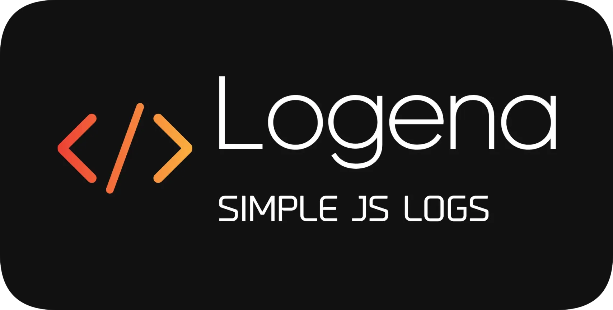

<p align="center">
    
</p>

I've made this simple logging system to help keep my logging consistent across projects. While unoriginal, it's a somewhat decent package for those looking for the same ideas I had in mind, since this one's a little different from others I've wanted to use.

## Features
- ✅ Customizable application name.
- ✅ Customizable colors for everything.
- ✅ No Dependencies, very demure.
- ✅ Optional Debug mode.
- ❌ Meows when an error occurs.


# Installation
This can be made via your package manager of choice, here's NPM as an example:

```bash
npm install logena
```

# Functions
### `logena.set`
#### Parameters
- `config`: An object containing configuration options.
    - `debug` (optional): `boolean` - Enable or disable debug mode.
    - `appName` (optional): `string` - Set the application name.
    - `useTimestamps` (optional): `boolean` - Enable or disable timestamps in logs.
    - `colors` (optional): `object` - Customize colors.
        - `timestamp`: `string` - Color for the timestamp.
        - `appName`: `string` - Color for the application name.
        - `message`: `string` - Color for the message.
        - `levels`: `object` - Customize colors for different log levels.
            - `info`: `string` - Color for info level logs.
            - `warn`: `string` - Color for warn level logs.
            - `error`: `string` - Color for error level logs.
            - `debug`: `string` - Color for debug level logs.

- `logena.info`
- `logena.warn`
- `logena.error`
- `logena.debug`

### `logena.info`
#### Parameters
- `appName` (optional): `string` - Set the application name (Overrides preset name).
- `message`: `string | object` - The message to log.

### `logena.warn`
#### Parameters
- `appName` (optional): `string` - Set the application name (Overrides preset name).
- `message`: `string | object` - The message to log.

### `logena.error`
#### Parameters
- `appName` (optional): `string` - Set the application name (Overrides preset name).
- `message`: `string | object` - The message to log.

### `logena.debug` (ONLY LOGS IF DEBUG MODE IS ENABLED VIA `logena.set`)
#### Parameters
- `appName` (optional): `string` - Set the application name (Overrides preset name).
- `message`: `string | object` - The message to log.

# JS Examples
- TypeScript works as well, via import syntax.
```js
const {Logena} = require('logena');
// or import Logena from 'logena';

Logena.set({
    debug: true,
    appName: "LOGENA",
    colors: {
        appName: "red"
        levels: {
            info: "green"
        }
    }
    useTimestamps: true
});

Logena.info("Hello, world!"); // 2024-10-15 18:00:00Z [LOGENA] INFO: Hello, world!
Logena.warn("Hello, world!"); // 2024-10-15 18:00:00Z [LOGENA] WARN: Hello, world!
Logena.error("Hello, world!"); // 2024-10-15 18:00:00Z [LOGENA] ERROR: Hello, world!
Logena.debug("Hello, world!"); // 2024-10-15 18:00:00Z [LOGENA] DEBUG: Hello, world!
```

# License
MIT :3

# Contributing
Want to contribute? Feel free to fork and make a pull request! Every contribution will be reviewed, and appreciated.

## Hall of Contributors
- None yet, be the first?